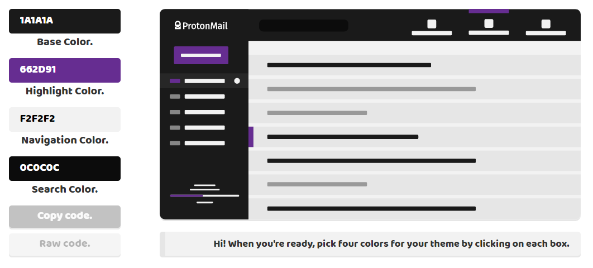

# Quark
*Now available for ProtonMail v3.7.3*
A theme creator for [ProtonMail](https://protonmail.com/) that creates quickly themes without having to type any CSS.
It creates a theme from four colors. You can select colors by using the color picker or by typing a hexadecimal value which will be applied when you click out of the color box.
Each color styles different areas and elements of the layout in order to reduce the time spent building a theme. You can use the preview to have an idea of how your color scheme will look when applied to account.

## [Use Quark](http://www.csalmeida.com/demos/quark/).

### How to use it.
1. Start by picking four colors, you can have a look at the preview to help you tweak them should you need it.
2. Once you are happy with your colors a bunch of code (CSS only) is going to be generated for you. Press the copy theme button to copy your theme to your clipboard. You can keep tweaking your color choices even after you pick four of them, just press copy code when you're ready. Alternatively, press Raw CSS to see the code that was generated.
3. Login on ProtonMail, head to Settings, click on the Appearance tab and paste the theme on Custom Theme. Press save and your colors on your account should change.

*In order to remove a theme, press clear.*
